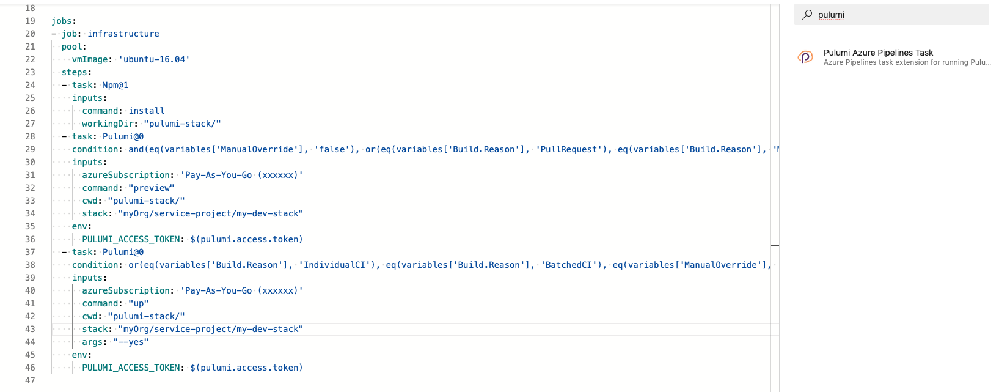
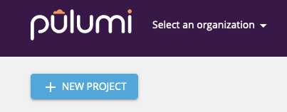
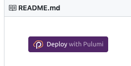

# Pulumi Azure task extension for Azure Pipelines

This extension allows you to run your Pulumi apps in Azure Pipeline as a build and release task.

Here's how a typical Azure Pipelines build configuration file in YAML looks like using the Pulumi task.

Alternatively, you can also use the classic wizard UI to setup a new Azure Pipeline build for your Azure DevOps project. Simply search for the Pulumi task by typing "pulumi" in the list of tasks.

Don't know how to get started? We got you covered with an extensive library of easy examples to get you started within minutes.
Read on to learn how you can get started quickly.

## Quickstart

The goal of the quickstart is to help you setup a "stack" on app.pulumi.com for your account. You can then setup CI in your Azure Pipelines to deploy infrastructure to it.

- If you haven't already signed-up, you may signup for an account at https://app.pulumi.com/signup using your preferred identity. We support GitHub, GitLab, Atlassian, and just email/password.
- Once you are logged-in, click on the **New Project** button as shown in the screenshot below, and follow the on-screen instructions to complete setting up a new project.

- Alternatively, you can pick an example from our examples repo at https://github.com/pulumi/examples. Simply click on the **Deploy with Pulumi** button (shown below) to get started.

## FAQs

### What is Pulumi?

Pulumi enables developers to write code in their favorite language (e.g., JavaScript, Python, Go), deploying cloud apps and infrastructure easily, without the need to learn specialized DSLs or YAML templating solutions.

The use of first class languages enables abstractions and reuse, in addition to software engineering practices like great IDEs, refactoring, and testing. Pulumi provides high-level cloud packages in addition to low-level resource definitions across all the major clouds -- AWS, Azure, GCP, and Kubernetes -- so that you can master one system to deliver to them all.

### I have an app that I need to deploy to Azure, and GCP. Can I still use Pulumi?

Yes! Pulumi enables you to achieve continuous delivery of cloud apps and infrastructure to any cloud environment -- AWS, Azure, GCP, Kubernetes, and even hybrid and on-premises envioronments.

### Is this extension open-source?

Yes. The source code for this extension is at https://github.com/pulumi/pulumi-az-pipelines-task.

The Pulumi platform is open-source as well. Visit our GitHub repo at https://github.com/pulumi/pulumi.
